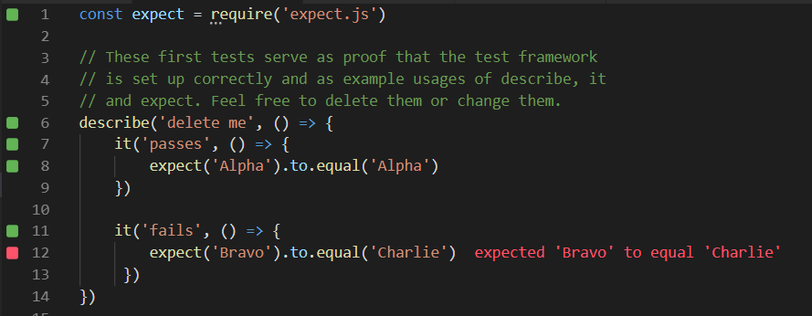

Bootstrap repository you can clone to start a new code kata.

The project contains configuration to work out of the box with the `quokka-mocha-bdd` plugin.
This means it also depends on and installs `mocha`. 

To get started you can take a look at [example.spec.js](./example.spec.js).  
If you're already familiar with mocha, dive right into your kata in [kata.spec.js](./kata.spec.js).

## Usage

Clone the repository and `cd` into it, then:

````
npm install
npm test
````

If you want to test in watch mode:

````
npm test -- --watch
````

### With [VS Code](https://code.visualstudio.com/) and [Quokka.js](https://quokkajs.com/) ...

Open the cloned repository in VS code and start a Quokka session on the [kata.spec.js](./kata.spec.js) file (default shortcut in VS Code with the Quokka extension installed: `Ctrl+K, Q`):


**Note:** The free version of Quokka does not allow you to import local modules (npm modules are supported).
So, if you want to use the free version your production and test code streams will share the same file.  
For code katas I don't consider this to be an issue.
